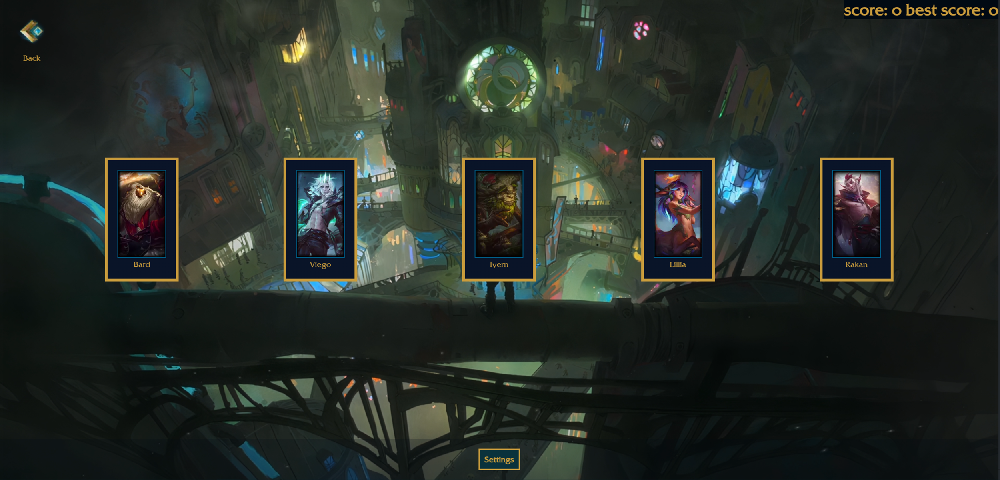

<h1 align='center' >Stelios Pnevmatikakis </h1>

How to connect:

  

I’m a software developer with a background in automotive engineering, specializing in full-stack web development and robotics.

I take the growth mindset to heart, trying to grab every opportunity to improve and grow my skills. 

<h2 align='center'>Weapons</h2>

<h3 align='center'>Frontend</h3>

<table align='center'>
  <tbody>
    <tr valign="top">
      <td width="25%" align="center">
        TypeScript   
        
      </td>
      <td width="25%" align="center">
        React   
        
      </td>
      <td width="25%" align="center">
        Shadcn   
        
      </td>
    </tr>
  </tbody>
</table>

<h3 align='center'>Backend</h3>
<table align="center">
  <tbody>
    <tr>
      <td width="25%" align="center">
        NextJS   
        
      </td>
      <td width="25%" align="center">
        PostgreSQL   
        
      </td>
      <td width="25%" align="center">
        NodeJS   
        
      </td>
    </tr>
  </tbody>
</table>

<h3 align='center'>Tools</h3>
<table align="center">
  <tbody>
    <tr>
      <td width="25%" align="center">
        Git   
        
      </td>
      <td width="25%" align="center">
        Prisma   
        
      </td>
            <td width="25%" align="center">
        GitHub Actions   
        
      </td>
    </tr>
      <tr>
        <td width="25%" align="center">
          AWS   
          
        </td>
        <td width="25%" align="center">
          Tailwind   
          
        </td>
        <td width="25%" align="center">
          Zod   
          
        </td>
    </tr>
  </tbody>
</table>

<h1 align="center">Projects</h1>

<table align='center'>
  <tr>
    <td width='50%'>
      <h2 align='center'>Urban Tide</h2>
      
  
        

          
           
           
          
        

        
<strong>NextJS, React</strong>

      

    </td>
    <td width='50%'>
      <h2 align='center'>League of Memory</h2>
      
  
        

           
           
           
          
        

        
<strong>NextJS, React, Framer</strong>

      

    </td>
  </tr>
</table>

<!--  -->
